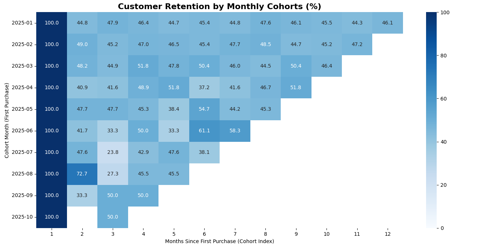

#  E-Commerce Customer Retention & Cohort Analysis

### **Business Problem**
The CEO of "PuneKart" noticed that while the platform was acquiring new users daily, monthly recurring revenue was flat. The business question was clear: *Are we losing our existing customers immediately after their first purchase?*

### **The Solution**
I engineered an end-to-end data analytics pipeline to calculate customer churn. To simulate a real world production environment, I generated synthetic transactional data, stored it in a relational database, extracted it using SQL, and engineered cohort metrics using Pandas. 

**Tech Stack:** Python, SQLite, Pandas, NumPy, Seaborn

### **Methodology (The Data Pipeline)**
1. **Data Generation:** Used NumPy to mock 500+ realistic transaction records across Users, Products, and Orders tables.
2. **Relational Extraction:** Loaded the data into a local SQLite database and wrote complex SQL `JOIN` queries to extract a unified view of customer spending.
3. **Feature Engineering:** Used Pandas datetime manipulation (`.dt.to_period`) and grouping transformations to calculate a custom `Cohort Index` for every order.
4. **Matrix Pivoting:** Pivoted the dataset to calculate the percentage of returning users month-over-month.

### **The Business Insight**
*The heatmap below visualizes the percentage of users who return to make a purchase in the months following their initial sign-up.*

**Recommendation:** The cohort analysis reveals a severe retention bottleneck. While acquisition is strong (100% in Month 1), there is a massive drop off in Month 2. The marketing team is wasting their budget acquiring users who do not stay. I recommend shifting 20% of the acquisition budget into a targeted "Month 2 Re-engagement Discount" email campaign to improve the lifetime value (LTV) of our existing user base.
